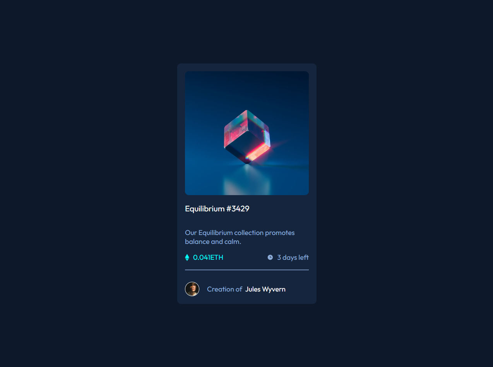

# Frontend Mentor - NFT preview card component solution

This is a solution to the [NFT preview card component challenge on Frontend Mentor](https://www.frontendmentor.io/challenges/nft-preview-card-component-SbdUL_w0U). Frontend Mentor challenges help you improve your coding skills by building realistic projects.

## Table of contents

- [Overview](#overview)
  - [The challenge](#the-challenge)
  - [Screenshot](#screenshot)
  - [Links](#links)
- [My process](#my-process)
  - [Built with](#built-with)
  - [What I learned](#what-i-learned)
  - [Continued development](#continued-development)
  - [Useful resources](#useful-resources)
- [Author](#author)
- [Acknowledgments](#acknowledgments)

## Overview

### The challenge

Users should be able to:

- View the optimal layout depending on their device's screen size
- See hover states for interactive elements

### Screenshot



### Links

- Solution URL: [Add solution URL here](https://github.com/nayabatir1/NFT-preview-card-component)
- Live Site URL: [Add live site URL here](https://nayabatir1.github.io/NFT-preview-card-component/)

## My process

### Built with

- Semantic HTML5 markup
- CSS custom properties
- Flexbox
- CSS Grid
- Mobile-first workflow

### What I learned

Revised concept of mobile first desing, grid and flexbox.

I've added backgound image and hover effect without using position absolute.

```html
<div class="image">
  <div class="view">
    
  </div>
</div>
```

```css
.image {
  background-image: url("./images/image-equilibrium.jpg");
  background-size: cover;
  width: 100%;
  height: 20rem;
  border-radius: inherit;
}

.view {
  background-color: hsla(var(--cyan), 0.4);
  opacity: 0;
  height: 100%;
  width: 100%;
  display: grid;
  place-items: center;
  border-radius: inherit;
}

.view:hover {
  opacity: 1;
  cursor: pointer;
}
```

### Continued development

I want to continue focusing on designing mobile first design approach.

### Useful resources

## Author

- Website - [Atir Nayab](https://www.your-site.com)
- Frontend Mentor - [@nayabatir1](https://www.frontendmentor.io/profile/nayabatir1)
- Twitter - [@nayabatir1](https://www.twitter.com/nayabatir1)

## Acknowledgments

I would like to thank [Frantz Kati](https://twitter.com/bahdcoder), he did an exceptional work with growth tracker. He shared many resources how to upskill myself.
